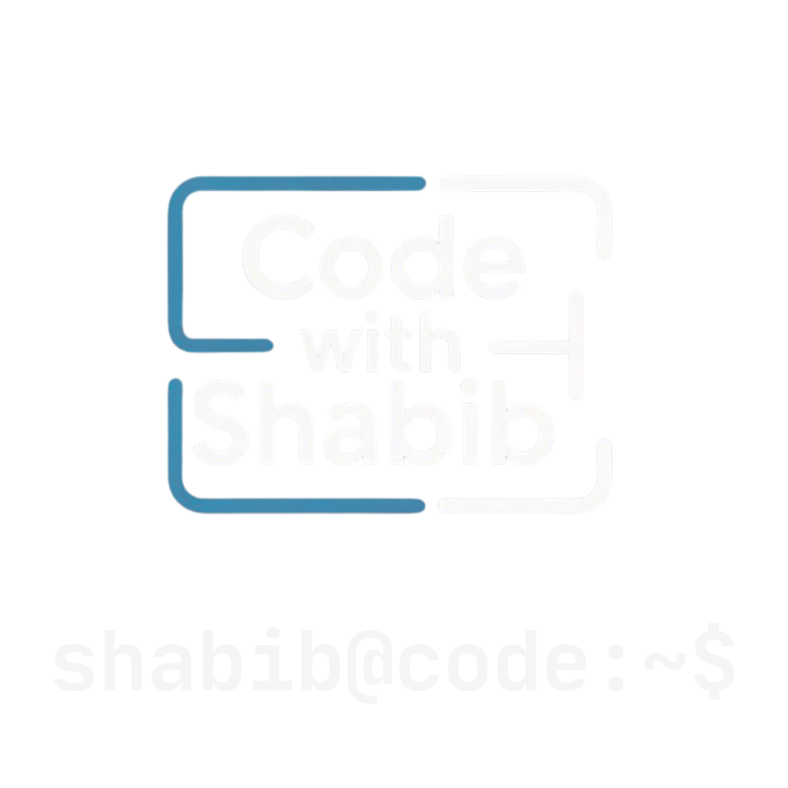

<p align="left">
  
</p>

# codewithshabib.com

This is my personal blog and writing archive. I occasionally share thoughts on programming, technology, and the craft of building software — with the occasional dive into life and systems thinking.

> 📌 This is a personal project. I’m not accepting issues, pull requests, or contributions.

## AI Workflow

This repo includes a repo-local AI workflow for brainstorming, drafting, validating, publishing,
auditing site quality, and packaging changes for review. Repo-scoped Codex slash commands live
under `.codex/prompts/`. Start with
[`./.codex/docs/README.md`](./.codex/docs/README.md).

## Local Setup

The local setup contract is intentionally narrow:

- Required on the machine: `ruby`, `git`, and `homebrew`
- Repo-managed and bootstrapped by `make setup`: Bundler, a pinned repo-local `pre-commit`,
  and pinned lint/security hooks for ShellCheck, actionlint, and Semgrep
- Ruby is pinned via `.ruby-version`, and Bundler installs are isolated to `vendor/bundle`
  with the lockfile treated as authoritative

Run:

```bash
make setup
```

After setup, the repo-managed `pre-commit` lives under `.venv-tools/`, and git hooks are
installed automatically for both `pre-commit` and `pre-push`.

That means normal `git commit` and `git push` already run the configured checks.

Use these commands only when you want an explicit manual verification pass:

```bash
make qa-local
make check
./.venv-tools/bin/pre-commit run --all-files
./.venv-tools/bin/pre-commit run --hook-stage pre-push --all-files
```

## Acknowledgments

This site is powered by [Jekyll](https://jekyllrb.com/) and the
[Minimal Mistakes](https://mmistakes.github.io/minimal-mistakes/) theme by Michael Rose.
Both are open source and licensed under the [MIT License](https://opensource.org/licenses/MIT).

---

## License

This project uses a hybrid license model:

- Content in the `_posts` directory is licensed under the
  [Creative Commons Attribution-ShareAlike 4.0 International License](https://creativecommons.org/licenses/by-sa/4.0/).
  You may share or adapt blog posts with proper attribution and the same license.

- All other content in this repository (e.g., layouts, config, assets) is proprietary and not licensed for reuse.

See [`LICENSE.md`](LICENSE.md) for full terms.

© 2026 Ahmad Shabibul Hossain (CodeWithShabib). All rights reserved.
