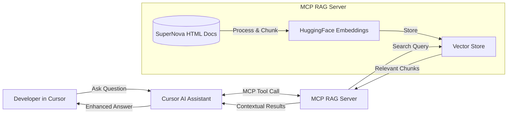

Let's be real. Documentation is often the unsung hero of developer experience. But even the best docs are useless if they're buried somewhere nobody looks. For years, we've been trying to solve this with better search, better organization, and better writing. Yet somehow, most developers still resort to Google searches or asking teammates instead of digging through official docs.

What if there was a way to bring documentation directly into developers' workflow? No context switching, no hunting through multiple tabs, no fighting with search engines that don't understand what you're really asking.

That's what I've been experimenting with recently: an MCP RAG server that lets developers search documentation without ever leaving their code editor.

## What's the Problem?

At SuperNova (our imaginary company), we had a growing documentation problem. Our mobile SDK had hundreds of components, each with its own configuration options, examples, and gotchas. New team members were spending days trying to find the right information, and even experienced devs were wasting time hunting through multiple sources.

The problem wasn't the quality of our docs. It was the experience of accessing them.

## Breaking Down the Solution

Before jumping into code, let's untangle what each piece of this solution actually does:

### MCP (Model Context Protocol)

MCP is an open protocol that connects AI assistants to tools, letting them reach outside the chat window to access specific functions. Think of it as a standardized way for LLMs to call external tools and bring results back to your conversation.

In practical terms, it's what allows coding assistants like Cursor to run executable code, access real-time data, or query custom databases - all without leaving the editor.

### RAG (Retrieval-Augmented Generation)

RAG is a technique that enhances language models by retrieving relevant information from a knowledge base before generating responses. Instead of relying solely on what the model was trained on, RAG pulls in specific contextual information that might be more accurate, up-to-date, or domain-specific.

For documentation search, this means the model can pull in the exact reference material needed to answer a technical question, rather than hallucinating or giving general advice.

### Vector Stores

Vector databases store and retrieve information based on semantic similarity, not just keyword matching. They convert text into numerical vectors (embeddings) that capture meaning, allowing for more intelligent "fuzzy" searches.

For our docs, this means developers can ask questions in natural language and get relevant results even if they don't use the exact terminology from the documentation.

So how do all these pieces fit into a single flow developers can use without friction?

## How They Work Together

Here's how these components create a seamless documentation experience:

1. A developer asks a question in Cursor's chat interface
2. The MCP protocol connects their question to our custom search tool
3. Our RAG system finds relevant documentation chunks using semantic search
4. The results get passed back to the assistant, which can now give an informed answer

No browser tabs. No context switching. Just answers, right there in the editor.

## Building the Solution

I didn’t plan to build a local RAG server. But once I saw how well MCP plugged into Cursor, it clicked—this could actually work.

### System Architecture



### Setting Up the MCP Server

The heart of our system is the MCP server that exposes a tool for searching documentation. Here's the key code from `mcp.ts`:

```typescript
const mcp = () => {
  const server = new McpServer({
    name: 'Supernova MCP RAG Server',
    version: '1.0.0',
  });

  const {
    initializeVectorStore,
    getVectorStore,
  } = rag();

  server.tool(
    'search_docs',
    {
      query: z.string(),
      k: z.number().optional().default(3),
    },
    async ({ query, k }) => {
      const vectorStore = getVectorStore();
      if (!vectorStore) throw new Error('Vector store not initialized');
      const results = await vectorStore.similaritySearch(query, k ?? 3);
      return {
        content: results.map(r => ({
          type: 'text',
          text: r.pageContent,
          source: r.metadata.source,
        })),
      };
    }
  );

  async function main() {
    await initializeVectorStore();
    const transport = new StdioServerTransport();
    await server.connect(transport);
  }
};
```

This defines a server with a single tool called `search_docs` that takes a query string and returns relevant documentation chunks.

### Building the RAG Pipeline

The real magic happens in the RAG implementation. Here's where we:
1. Find all HTML documentation files
2. Extract and clean the text
3. Split into manageable chunks
4. Create embeddings using HuggingFace
5. Store everything in an in-memory vector database

Here's how the core RAG functionality works in `rag.ts`:

```typescript
async function* getAllHtmlFiles(dir: string): AsyncGenerator<string> {
  const dirents = await fs.readdir(dir, { withFileTypes: true });
  for (const dirent of dirents) {
    const res = path.resolve(dir, dirent.name);
    if (dirent.isDirectory()) {
      yield* getAllHtmlFiles(res);
    } else if (dirent.isFile() && res.endsWith('.html')) {
      yield res;
    }
  }
}
```

I used a generator function here for a reason. When recursively searching through a large documentation set, loading everything into memory at once can be inefficient. The generator pattern allows us to process files one at a time, keeping memory usage low while still handling a large number of files.

This function yields paths one by one as it finds them, rather than building a giant array in memory. It's a small optimization, but these kinds of details matter when you're dealing with potentially thousands of documentation files.

With the files identified, we process them into a format suitable for semantic search:

```typescript
const initializeVectorStore = async (): Promise<void> => {
  // Find all HTML files recursively
  const htmlFiles: string[] = [];
  for await (const file of getAllHtmlFiles(docsDir)) {
    htmlFiles.push(file);
  }

  // Extract text from each HTML file and collect with metadata
  const allDocs: { pageContent: string; metadata: { source: string } }[] = [];
  for (const file of htmlFiles) {
    try {
      const text = extractTextFromHtml(file);
      allDocs.push({
        pageContent: text,
        metadata: { source: path.relative(docsDir, file) },
      });
    } catch (e) {
      console.warn(`Failed to extract text from ${file}:`, e);
    }
  }

  // Split all documents into chunks (preserving metadata)
  const textSplitter = new RecursiveCharacterTextSplitter({
    chunkSize: 1000,
    chunkOverlap: 200,
  });
  const chunks = await textSplitter.splitDocuments(allDocs);

  // Create embeddings and vector store
  const embeddings = new HuggingFaceInferenceEmbeddings({
    model: 'sentence-transformers/all-MiniLM-L6-v2',
    apiKey: HUGGINGFACE_API_KEY,
  });

  try {
    vectorStore = await MemoryVectorStore.fromDocuments(chunks, embeddings);
    console.info(
      'Vector store initialized with',
      chunks.length,
      'chunks from',
      htmlFiles.length,
      'files.'
    );
  } catch (error) {
    console.error('Error initializing vector store:', error);
    throw error;
  }
};
```

## Real-World Considerations

This implementation works well for small to medium documentation sets, but there are some minimal practical considerations for production use:

### Performance Tradeoffs

The current setup comes with a few deliberate performance tradeoffs:

1. **In-Memory Storage**: Fast for small to medium documentation sets, but not ideal for very large corpora.
2. **On-the-Fly Embedding**: We generate embeddings at server startup, which makes initial startup slower but ensures all content is searchable.
3. **Sequential Processing**: Files are processed one after another for simplicity.

For a POC or small team documentation, this approach works fine. The startup time is acceptable, and the memory usage is reasonable.

### API Rate Limits

One practical challenge with free services is rate limits. The HuggingFace Inference API has limits (around 300 requests/hour for free users). If you have thousands of documentation chunks, you might hit these limits during initialization.

For a production system, you might want to:
1. Batch your embedding requests
2. Cache embeddings to disk
3. Consider a paid API plan or self-hosted embedding model

### Extending With LangChain and LangGraph

This setup works on its own, but if you want to extend it, LangChain and LangGraph offer some ready-made components:

- **Better Chunking Strategies**: LangChain provides more sophisticated text splitting methods that can preserve document structure
- **Chain of Thought Reasoning**: Build more complex query pipelines that refine search results
- **Hybrid Search**: Combine semantic and keyword search for better precision
- **Source Attribution**: Track exactly which parts of the documentation contributed to answers

## Using It In Practice

Here's how a developer actually uses this in their workflow:

1. Open Cursor
2. Configure the MCP server by pointing to your server:
   ```json
   {
     "mcpServers": {
       "mcp-rag-server": {
         "command": "node",
         "args": [
           "/path-to/supernova-mcp-rag/mcp-rag-server/dist/index.js"
         ],
         "disabled": false,
         "autoApprove": []
       }
     }
   }
   ```
3. Ask questions about documentation directly in their editor

For example, they might ask:
> "Can you call the MCP tool to look up how to add a hero card using SuperNovaStorybook-Mobile-Swift?"

The assistant now has direct access to the relevant documentation chunks and can provide an accurate, contextual answer without the developer ever having to leave their editor.

## Beyond Documentation: Other Applications

This same pattern can be applied to other developer experience improvements:

- Searching codebase for examples and patterns
- Finding relevant test cases
- Locating configuration options across microservices
- Exploring architecture decisions from ADRs

## Is It Worth It?

Let's break down the cost-benefit analysis:

**Time Investment:**
- Initial setup
- Customizing for your docs
- Adding to your workflow

**Benefits:**
- Reduced context switching during development
- Faster onboarding for new team members
- More accurate answers based on your actual documentation
- Documentation usage analytics (if you add telemetry)

For teams with substantial documentation or specialized knowledge requirements, the ROI can be significant. Even saving 15 minutes per developer per day adds up quickly.

## Key Takeaways

1. **Modern tools make this accessible**: You don't need deep ML expertise to implement a practical RAG system
2. **Start small**: An in-memory approach works fine for most documentation sets
3. **Free tiers work for POCs**: HuggingFace's free embedding API is sufficient for testing
4. **Workflow integration matters**: The best documentation search is the one developers actually use

This is just the beginning of what's possible with MCP and RAG for developer tools. The core idea—bringing information to where developers already work—can be extended in countless ways.

For your next project, consider: what other information could you bring directly into your development environment?

_The full code is available at [github.com/shabib87/supernova-mcp-rag](https://github.com/shabib87/supernova-mcp-rag)_

## References

- [Model Context Protocol (MCP) Introduction](https://modelcontextprotocol.io/introduction)
- [Cursor MCP Integration Guide](https://docs.cursor.com/context/model-context-protocol#remote-development)
- [AWS Explanation of Retrieval-Augmented Generation (RAG)](https://aws.amazon.com/what-is/retrieval-augmented-generation/)
- [Retrieval Augmented Generation (RAG) and Semantic Search for GPTs](https://help.openai.com/en/articles/8868588-retrieval-augmented-generation-rag-and-semantic-search-for-gpts)

- [How to Build an MCP Server Fast: A Step-by-Step Tutorial](https://medium.com/@eugenesh4work/how-to-build-an-mcp-server-fast-a-step-by-step-tutorial-e09faa5f7e3b)
